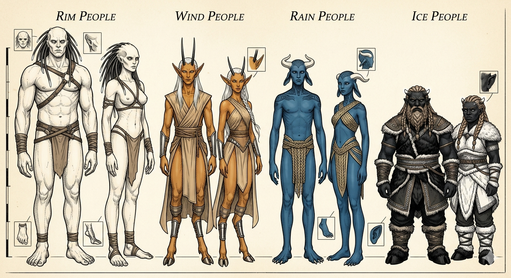

# Peuples d'Aeonir

Aeonir abrite une espèce intelligente répartie en **quatre grands groupes**, chacun forgé par son environnement sur des millénaires. Les individus issus d'unions entre ces peuples — les **sang-mêlés** — portent les traits biologiques de leurs deux ancêtres, dans une expression atténuée mais plus flexible.

## Les Quatre Peuples

| Peuple                                    | Zone      | Traits distinctifs                                       |
| :---------------------------------------- | :-------- | :------------------------------------------------------- |
| [**Peuple des Cimes**](peuple_cimes.md)   | Levant    | Épines ferriques bioluminescentes, peau ivoire, colossal |
| [**Peuple des Vents**](peuple_vents.md)   | Couchant  | Cornes verticales, pieds digitigrades, ambré             |
| [**Peuple des Pluies**](peuple_pluies.md) | Pôle Nord | Peau céruléenne, cornes-couronne, membrane nictitante    |
| [**Peuple des Neiges**](peuple_neiges.md) | Pôle Sud  | Bioluminescence contrôlée, anthracite, massif            |

---

## Traits Phénotypiques — Récapitulatif

La biologie de chaque peuple se traduit mécaniquement par **5 traits phénotypiques** (un par catégorie), chacun octroyant **+1 dans une compétence**. À la création, le joueur **sélectionne 4 catégories sur 5** — la catégorie écartée reste visible sur le corps, mais son expression est trop faible pour conférer un bonus. Les règles de sélection sont décrites dans [Personnages](../core/personnages.md).

> ⚙️ **À développer :** une passe d'équilibrage est prévue sur les traits phénotypiques pour offrir davantage d'options de compétences mentales (17 des 20 cases de la table sont aujourd'hui des compétences corporelles).

| Catégorie      | Cimes *(Levant)* | Vents *(Couchant)* | Pluies *(Pôle Nord)* | Neiges *(Pôle Sud)* |
| :------------- | :--------------: | :----------------: | :------------------: | :-----------------: |
| **Crâne**      |   Clairvoyance   |    Observation     |      Robustesse      |     Réactivité      |
| **Stature**    |    Puissance     |     Endurance      |       Mobilité       |      Endurance      |
| **Locomotion** |     Mobilité     |      Mobilité      |      Précision       |     Robustesse      |
| **Sens**       |    Intuition     |     Vigilance      |     Observation      |      Vigilance      |
| **Peau**       |    Précision     |     Prestance      |      Endurance       |    Récupération     |

---

## Sang-Mêlés

Un sang-mêlé hérite de la biologie de **deux peuples**. Il sélectionne **4 catégories sur 5** et, pour chacune, choisit librement la version de l'un ou l'autre de ses ancêtres. La catégorie abandonnée représente un trait trop dilué pour s'exprimer pleinement.

### Opportunités de Spécialisation

Certaines compétences apparaissent dans plusieurs peuples sous des **catégories différentes**. En les combinant, un sang-mêlé peut obtenir +2 dans une même compétence, déclenchant immédiatement le bonus de caractéristique associé (rang 2).

| Compétence ×2 | Peuples | Catégories |
| :--- | :--- | :--- |
| **Mobilité** | Cimes / Pluies | Locomotion (Cimes) + Stature (Pluies) |
| **Mobilité** | Vents / Pluies | Locomotion (Vents) + Stature (Pluies) |
| **Endurance** | Vents / Pluies | Stature (Vents) + Peau (Pluies) |
| **Endurance** | Pluies / Neiges | Peau (Pluies) + Stature (Neiges) |
| **Robustesse** | Pluies / Neiges | Crâne (Pluies) + Locomotion (Neiges) |
| **Observation** | Vents / Pluies | Crâne (Vents) + Sens (Pluies) |
| **Précision** | Cimes / Pluies | Peau (Cimes) + Locomotion (Pluies) |

> **Note :** Mobilité apparaît dans la catégorie **Locomotion** pour les Cimes *et* les Vents. Un sang-mêlé Cimes/Vents ne peut choisir qu'une seule version de Locomotion : le doublement de Mobilité exige un ancêtre Pluies (via Stature).
